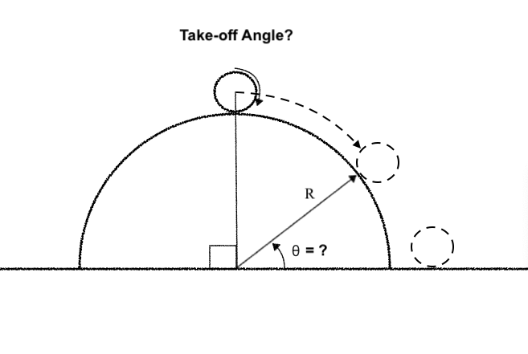
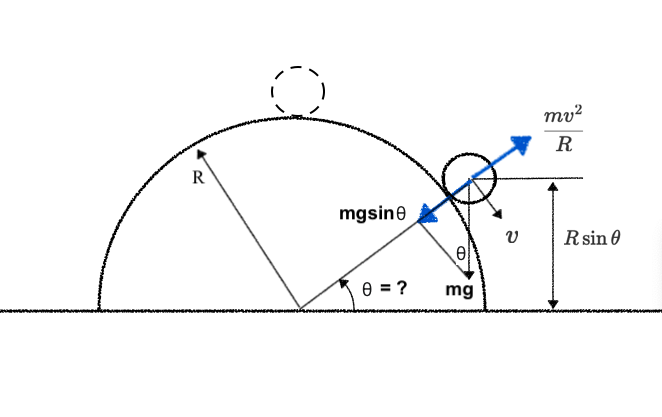

# **Ball Rolling Off a Semicircle**

We have a semicircle placed on the ground, with its flat side down. Imagine looking at it from the side; it's like a half-circle standing upright. At the very top (90 degrees from the horizontal), we place a ball. As the ball rolls down the semicircle, at some point, it will no longer be in contact with the surface—it will "take off" or "fly off" the semicircle. We need to determine the angle at which this happens.

Let’s solve the problem step-by-step with clear definitions and correct force decomposition.

---

## **1. Problem Setup**
- A semicircle of radius **$R$** is placed on the ground (flat side down).
- A ball is placed at the **top (90° from the horizontal)** and rolls down.
- We want to find the angle **$\theta$** (measured from the **horizontal**) at which the ball loses contact with the semicircle.

---

## **2. Key Physics Concepts**
### **Forces Acting on the Ball**
1. **Gravity ($mg$)**  
   - Acts vertically downward.
   - Can be split into two components relative to the semicircle’s surface:
     - **Radial (toward center)**: $mg \sin \theta$
     - **Tangential (along surface)**: $mg \cos \theta$

2. **Normal Force ($N$)**  
   - The normal force is the reaction force exerted by the semicircle on the ball, **perpendicular to the surface** (away from the center).
   - **Decreases as the ball rolls down** because part of gravity provides the centripetal force.
   - **At liftoff, $N = 0$.**
   - **General Formula**:

$$
         N = mg \sin \theta - \frac{mv^2}{R}
$$

         Derived from Newton’s 2nd Law in the radial direction:

$$
         \sum F_{\text{radial}} = mg \sin \theta - N = \frac{mv^2}{R}.
$$

   - **Behavior**:

- **At the top (\(\theta = 90°\)):**  
  \(N = mg\) (ball is at rest, no centripetal force needed).

- **As \(\theta\) decreases:**  
  \(N\) decreases because \(v\) increases, requiring more centripetal force.

- **At liftoff (\(\theta = \arcsin(2/3)\)):**  
  \(N = 0\).

### **Liftoff Condition**
The ball loses contact when the **normal force $N$ drops to zero**. At this point:
- The **radial component of gravity ($mg \sin \theta$)** must exactly provide the **centripetal force** required for circular motion:

$$
  mg \sin \theta = \frac{mv^2}{R}
$$

$$
  \Rightarrow v^2 = Rg \sin \theta \quad \text{(1)}
$$

### **Energy Conservation**
- Initial energy (top, $\theta = 90°$):  

$$
  E = mgR
$$

- At angle $\theta$, height $= R \sin \theta$, so potential energy $= mgR \sin \theta$.  
- Kinetic energy $= \frac{1}{2} mv^2$.  
- Energy conservation gives:

$$
  mgR = \frac{1}{2} mv^2 + mgR \sin \theta
$$

$$
  \Rightarrow v^2 = 2gR (1 - \sin \theta) \quad \text{(2)}
$$

---

## **3. Solving for the Liftoff Angle**
Equate $v^2$ from (1) and (2):

$$
Rg \sin \theta = 2gR (1 - \sin \theta)
$$

$$
\sin \theta = 2 - 2 \sin \theta
$$

$$
3 \sin \theta = 2
$$

$$
\sin \theta = \frac{2}{3}
$$

$$
\theta = \arcsin \left( \frac{2}{3} \right) \approx 41.8°
$$

---

## **4. Final Answer**
The ball loses contact with the semicircle at:  

$$
\boxed{\theta = \arcsin \left( \frac{2}{3} \right) \approx 41.8° \text{ from the horizontal}}
$$

---

## **5. Verification**
- **At $\theta = 41.8°$:**
  - $\sin \theta = \frac{2}{3}$, so $v^2 = Rg \cdot \frac{2}{3}$.
  - From energy: $v^2 = 2gR \left( 1 - \frac{2}{3} \right) = \frac{2}{3} gR$.  
  - Both match, confirming consistency.

---

## **6. Common Mistakes to Avoid**
1. **Incorrect Force Decomposition**  
   - If $\theta$ is measured from the **vertical**, the radial component is $mg \cos \theta$, but here $\theta$ is from the **horizontal**, so it’s $mg \sin \theta$.

2. **Misapplying Centripetal Force**  
   - The centripetal force is **not an extra force**—it’s the **net radial force** required for circular motion. Here, it’s provided by $mg \sin \theta$ when $N = 0$.

3. **Energy Conservation Errors**  
   - Ensure the initial height is $R$ (top of semicircle), not $2R$.

---

## **7. Intuitive Explanation**
- As the ball rolls down:
  - Gravity’s **radial component** decreases (since $\sin \theta$ decreases).
  - The **speed $v$** increases, requiring more centripetal force.
- At $\theta = 41.8°$, gravity can no longer provide enough inward force, so the ball **flies off**.

---

## **Summary**
- **Angle definition**: $\theta$ is from the **horizontal**.
- **Liftoff condition**: $N = 0$, so $mg \sin \theta = mv^2 / R$.
- **Energy conservation**: Links $v$ and $\theta$.
- **Result**: $\theta = \arcsin(2/3) \approx 41.8°$.
